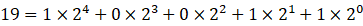
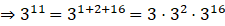
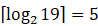

<html>

<head>
<meta http-equiv=Content-Type content="text/html; charset=gb2312">
<meta name=Generator content="Microsoft Word 15 (filtered)">

</head>

<body lang=ZH-CN style='text-justify-trim:punctuation'>

Tips
in programming

1.&nbsp;&nbsp;&nbsp;&nbsp;&nbsp; 快速幂算法

该法利用了指数的二进制分解。以计算319为例。

这样，原本需要进行19次操作的幂计算，只需次操作即可完成（3次乘法加上幂翻倍，2次纯幂翻倍）。复杂度从朴素法的O(n)降到了O(logn)。

<b>Code:</b>

int quickpow(int a,int b,int c)

{

 int result=1,t=a;

 while (b)

 {

&nbsp;&nbsp;&nbsp; if (b%2) result=result*t%c;

&nbsp;&nbsp;&nbsp; b&gt;&gt;=1; t=t*t%c;

 }

 return result;

}

&nbsp;

2.&nbsp;&nbsp;&nbsp;&nbsp;&nbsp; STL std::deque

双端队列容器，可以使用一个可逆/随机访问迭代器。

<table class=MsoTableGrid border=1 cellspacing=0 cellpadding=0 width=559
 style='width:418.95pt;margin-left:18.0pt;border-collapse:collapse;border:none'>
 <tr style='height:18.2pt'>
  <td width=287 valign=top style='width:215.45pt;border:solid windowtext 1.0pt;
  padding:0cm 5.4pt 0cm 5.4pt;height:18.2pt'>
  
容器成员

  </td>
  <td width=271 valign=top style='width:203.5pt;border:solid windowtext 1.0pt;
  border-left:none;padding:0cm 5.4pt 0cm 5.4pt;height:18.2pt'>
  
操作

  </td>
 </tr>
 <tr style='height:18.2pt'>
  <td width=287 valign=top style='width:215.45pt;border:solid windowtext 1.0pt;
  border-top:none;padding:0cm 5.4pt 0cm 5.4pt;height:18.2pt'>
  
std::deque&lt;T&gt;::size()

  </td>
  <td width=271 valign=top style='width:203.5pt;border-top:none;border-left:
  none;border-bottom:solid windowtext 1.0pt;border-right:solid windowtext 1.0pt;
  padding:0cm 5.4pt 0cm 5.4pt;height:18.2pt'>
  
返回该双端队列的长度

  </td>
 </tr>
 <tr style='height:17.5pt'>
  <td width=287 valign=top style='width:215.45pt;border:solid windowtext 1.0pt;
  border-top:none;padding:0cm 5.4pt 0cm 5.4pt;height:17.5pt'>
  
std::deque&lt;T&gt;::push_back(T val)

  </td>
  <td width=271 valign=top style='width:203.5pt;border-top:none;border-left:
  none;border-bottom:solid windowtext 1.0pt;border-right:solid windowtext 1.0pt;
  padding:0cm 5.4pt 0cm 5.4pt;height:17.5pt'>
  
将值为val的项插入队列尾部

  </td>
 </tr>
 <tr style='height:18.2pt'>
  <td width=287 valign=top style='width:215.45pt;border:solid windowtext 1.0pt;
  border-top:none;padding:0cm 5.4pt 0cm 5.4pt;height:18.2pt'>
  
std::deque&lt;T&gt;::push_front(T val)

  </td>
  <td width=271 valign=top style='width:203.5pt;border-top:none;border-left:
  none;border-bottom:solid windowtext 1.0pt;border-right:solid windowtext 1.0pt;
  padding:0cm 5.4pt 0cm 5.4pt;height:18.2pt'>
  
将值为val的项插入队列头部

  </td>
 </tr>
 <tr style='height:18.2pt'>
  <td width=287 valign=top style='width:215.45pt;border:solid windowtext 1.0pt;
  border-top:none;padding:0cm 5.4pt 0cm 5.4pt;height:18.2pt'>
  
std::deque&lt;T&gt;::pop_back()

  </td>
  <td width=271 valign=top style='width:203.5pt;border-top:none;border-left:
  none;border-bottom:solid windowtext 1.0pt;border-right:solid windowtext 1.0pt;
  padding:0cm 5.4pt 0cm 5.4pt;height:18.2pt'>
  
弹出队列尾部项

  </td>
 </tr>
 <tr style='height:18.2pt'>
  <td width=287 valign=top style='width:215.45pt;border:solid windowtext 1.0pt;
  border-top:none;padding:0cm 5.4pt 0cm 5.4pt;height:18.2pt'>
  
std::deque&lt;T&gt;::pop_front()

  </td>
  <td width=271 valign=top style='width:203.5pt;border-top:none;border-left:
  none;border-bottom:solid windowtext 1.0pt;border-right:solid windowtext 1.0pt;
  padding:0cm 5.4pt 0cm 5.4pt;height:18.2pt'>
  
弹出队列头部项

  </td>
 </tr>
 <tr style='height:18.2pt'>
  <td width=287 valign=top style='width:215.45pt;border:solid windowtext 1.0pt;
  border-top:none;padding:0cm 5.4pt 0cm 5.4pt;height:18.2pt'>
  
std::deque&lt;T&gt;::begin()

  </td>
  <td width=271 valign=top style='width:203.5pt;border-top:none;border-left:
  none;border-bottom:solid windowtext 1.0pt;border-right:solid windowtext 1.0pt;
  padding:0cm 5.4pt 0cm 5.4pt;height:18.2pt'>
  
返回一个指向队列头的迭代器（也可写作front）

  </td>
 </tr>
 <tr style='height:17.5pt'>
  <td width=287 valign=top style='width:215.45pt;border:solid windowtext 1.0pt;
  border-top:none;padding:0cm 5.4pt 0cm 5.4pt;height:17.5pt'>
  
std::deque&lt;T&gt;::end()

  </td>
  <td width=271 valign=top style='width:203.5pt;border-top:none;border-left:
  none;border-bottom:solid windowtext 1.0pt;border-right:solid windowtext 1.0pt;
  padding:0cm 5.4pt 0cm 5.4pt;height:17.5pt'>
  
返回一个指向队列尾的迭代器（也可写作back）

  </td>
 </tr>
 <tr style='height:17.5pt'>
  <td width=287 valign=top style='width:215.45pt;border:solid windowtext 1.0pt;
  border-top:none;padding:0cm 5.4pt 0cm 5.4pt;height:17.5pt'>
  
std::deque&lt;T&gt;::iterator

  </td>
  <td width=271 valign=top style='width:203.5pt;border-top:none;border-left:
  none;border-bottom:solid windowtext 1.0pt;border-right:solid windowtext 1.0pt;
  padding:0cm 5.4pt 0cm 5.4pt;height:17.5pt'>
  
类型名。指向deque&lt;T&gt;中一个元素的随机访问迭代器

  </td>
 </tr>
 <tr style='height:17.5pt'>
  <td width=287 valign=top style='width:215.45pt;border:solid windowtext 1.0pt;
  border-top:none;padding:0cm 5.4pt 0cm 5.4pt;height:17.5pt'>
  
std::deque&lt;T&gt;::iterator operator ++

  
std::deque&lt;T&gt;::iterator operator --

  </td>
  <td width=271 valign=top style='width:203.5pt;border-top:none;border-left:
  none;border-bottom:solid windowtext 1.0pt;border-right:solid windowtext 1.0pt;
  padding:0cm 5.4pt 0cm 5.4pt;height:17.5pt'>
  
使迭代器指向下一个（上一个）元素

  </td>
 </tr>
</table>

&nbsp;

&nbsp;

&nbsp;

&nbsp;

&nbsp;

&nbsp;

3.&nbsp;&nbsp;&nbsp;&nbsp;&nbsp; Eratosthenes素数筛法

一种快速寻找素数（制作素数表）的方法。当需要频繁处理素数时此法优于朴素判定法。

具体步骤如下：

1.&nbsp;&nbsp;&nbsp;&nbsp;&nbsp; 先尝试第一个素数2，将2的每一个倍数都标记为合数

2.&nbsp;&nbsp;&nbsp;&nbsp;&nbsp; 再尝试下一个质数3，将其倍数标记为合数

3.&nbsp;&nbsp;&nbsp;&nbsp;&nbsp; 再尝试5,7,11,13……重复以上步骤

该法的时间复杂度为O(nlog log n)，快于只使用朴素法制表的O(n1.5)

<b>Code:</b>

void make(bool np[],int p[],int &amp;count,int n) 

{

&nbsp;&nbsp;&nbsp; int i; 

&nbsp;&nbsp;&nbsp; np[1]=1;

&nbsp;&nbsp;&nbsp; for (i=2;i*i&lt;=n;i++)

&nbsp;&nbsp;&nbsp; {

&nbsp;&nbsp;&nbsp;&nbsp;&nbsp;&nbsp; if (!np[i])

&nbsp;&nbsp;&nbsp;&nbsp;&nbsp;&nbsp; {

&nbsp;&nbsp;&nbsp;&nbsp;&nbsp;&nbsp;&nbsp;&nbsp;&nbsp;&nbsp; p[count++]=i;

&nbsp;&nbsp;&nbsp;&nbsp;&nbsp;&nbsp;&nbsp;&nbsp;&nbsp;&nbsp; for
(int j=i*i;j&lt;=n;j+=i)

&nbsp;&nbsp;&nbsp;&nbsp;&nbsp;&nbsp;&nbsp;&nbsp;&nbsp;&nbsp;&nbsp;&nbsp;&nbsp; np[j]=1;

&nbsp;&nbsp;&nbsp;&nbsp;&nbsp;&nbsp; }

&nbsp;&nbsp;&nbsp; }

&nbsp;&nbsp;&nbsp; for (;i&lt;=n;i++)

&nbsp;&nbsp;&nbsp;&nbsp;&nbsp;&nbsp; if (!np[i])

&nbsp;&nbsp;&nbsp;&nbsp;&nbsp;&nbsp; {

&nbsp;&nbsp;&nbsp;&nbsp;&nbsp;&nbsp;&nbsp;&nbsp;&nbsp;&nbsp; p[count++]=i;

&nbsp;&nbsp;&nbsp;&nbsp;&nbsp;&nbsp; }

}

&nbsp;

4.&nbsp;&nbsp;&nbsp;&nbsp;&nbsp; 记忆化搜索范例

在DFS/BFS的基础上，用表f存储w的计算状态（如果需要的话，再加一个表v记录是否算过）。

<b>Code: </b><i>(from luogu P1464
Function)</i>

int w(long long a,long long b,long long c)

{

&nbsp;&nbsp;&nbsp; //可以直接给出的例外值不需入表

&nbsp;&nbsp;&nbsp; if (a&lt;=0 || b&lt;=0 ||
c&lt;=0) return 1;

&nbsp;&nbsp;&nbsp; if (a&gt;20 || b&gt;20 ||
c&gt;20) 

&nbsp;&nbsp;&nbsp;&nbsp;&nbsp;&nbsp; return
w(20,20,20);

&nbsp;&nbsp;&nbsp; //核心1：已经算过的值就从“记忆”里找，不要再算

&nbsp;&nbsp;&nbsp; if (v[a][b][c]) return
f[a][b][c];

&nbsp;&nbsp;&nbsp; //核心2：算一次就要“记忆”下来

&nbsp;&nbsp;&nbsp; if (a&lt;b &amp;&amp; b&lt;c) 

&nbsp;&nbsp;&nbsp; {

&nbsp;&nbsp;&nbsp;&nbsp;&nbsp;&nbsp; v[a][b][c]=1;

&nbsp;&nbsp;&nbsp;&nbsp;&nbsp;&nbsp; return
f[a][b][c]=w(a,b,c-1)+w(a,b-1,c-1)-w(a,b-1,c);

&nbsp;&nbsp;&nbsp; }

&nbsp;&nbsp;&nbsp; v[a][b][c]=1;

&nbsp;&nbsp;&nbsp; return f[a][b][c]=w(a-1,b,c)+w(a-1,b-1,c)+w(a-1,b,c-1)-w(a-1,b-1,c-1);

}

&nbsp;

5.&nbsp;&nbsp;&nbsp;&nbsp;&nbsp; 快速排序

一种排序方法。核心是分治法和选“枢轴点”：对于每一段序列，在枢轴点两侧寻找不满足“左小右大”的值并交换，再对枢轴点两侧的序列重复以上操作，直到所有层级下枢轴点两侧均为“左小右大”为止。

最好时间复杂度O(n)

最坏时间复杂度O(n&shy;2)

平均时间复杂度O(nlogn)

<b>Code:</b>

//泛型化快速排序，支持对任意类型T排序，cmp为比较函数，x&lt;y时返回true

template&lt;typename T&gt;

void qsort(T* a,int l,int r,bool (*cmp)(T x,T y))//应用二分思想

&nbsp;

{

&nbsp;&nbsp;&nbsp; T mid=a[(l+r)/2];//中间数

&nbsp;&nbsp;&nbsp; int i=l,j=r;

&nbsp;&nbsp;&nbsp; do{

&nbsp;&nbsp;&nbsp;&nbsp;&nbsp;&nbsp;&nbsp; while(cmp(a[i],mid))
i++;//查找左半部分比中间数大的数

&nbsp;&nbsp;&nbsp;&nbsp;&nbsp;&nbsp;&nbsp; while(cmp(mid,a[j]))
j--;//查找右半部分比中间数小的数

&nbsp;&nbsp;&nbsp;&nbsp;&nbsp;&nbsp;&nbsp;
if(i&lt;=j)//如果有一组不满足排序条件（左小右大）的数

&nbsp;&nbsp;&nbsp;&nbsp;&nbsp;&nbsp;&nbsp; {

&nbsp;&nbsp;&nbsp;&nbsp;&nbsp;&nbsp;&nbsp;&nbsp;&nbsp;&nbsp;&nbsp;
//交换

&nbsp;&nbsp;&nbsp;&nbsp;&nbsp;&nbsp;&nbsp;&nbsp;&nbsp;&nbsp; T
tmp=a[i];

&nbsp;&nbsp;&nbsp;&nbsp;&nbsp;&nbsp;&nbsp;&nbsp;&nbsp;&nbsp; a[i]=a[j];

&nbsp;&nbsp;&nbsp;&nbsp;&nbsp;&nbsp;&nbsp;&nbsp;&nbsp;&nbsp; a[j]=tmp;

&nbsp;&nbsp;&nbsp;&nbsp;&nbsp;&nbsp;&nbsp;&nbsp;&nbsp;&nbsp;&nbsp;
i++;

&nbsp;&nbsp;&nbsp;&nbsp;&nbsp;&nbsp;&nbsp;&nbsp;&nbsp;&nbsp;&nbsp;
j--;

&nbsp;&nbsp;&nbsp;&nbsp;&nbsp;&nbsp;&nbsp; }

&nbsp;&nbsp;&nbsp; }while(i&lt;=j);//这里注意要有=

&nbsp;&nbsp;&nbsp; if(l&lt;j) qsort(l,j);//递归搜索左半部分

&nbsp;&nbsp;&nbsp; if(i&lt;r) qsort(i,r);//递归搜索右半部分

}

&nbsp;

&nbsp;

&nbsp;

&nbsp;

&nbsp;

&nbsp;

6.&nbsp;&nbsp;&nbsp;&nbsp;&nbsp; STL std::map

映射表容器，可以使用一个正向/反向/随机访问迭代器，所有元素均自动按字典升序排列。

<table class=MsoTableGrid border=1 cellspacing=0 cellpadding=0 width=559
 style='width:418.95pt;margin-left:18.0pt;border-collapse:collapse;border:none'>
 <tr style='height:18.2pt'>
  <td width=287 valign=top style='width:215.45pt;border:solid windowtext 1.0pt;
  padding:0cm 5.4pt 0cm 5.4pt;height:18.2pt'>
  
容器成员/用法

  </td>
  <td width=271 valign=top style='width:203.5pt;border:solid windowtext 1.0pt;
  border-left:none;padding:0cm 5.4pt 0cm 5.4pt;height:18.2pt'>
  
操作

  </td>
 </tr>
 <tr style='height:18.2pt'>
  <td width=287 valign=top style='width:215.45pt;border:solid windowtext 1.0pt;
  border-top:none;padding:0cm 5.4pt 0cm 5.4pt;height:18.2pt'>
  
std::map&lt;T1,T2&gt; a;

  </td>
  <td width=271 valign=top style='width:203.5pt;border-top:none;border-left:
  none;border-bottom:solid windowtext 1.0pt;border-right:solid windowtext 1.0pt;
  padding:0cm 5.4pt 0cm 5.4pt;height:18.2pt'>
  
定义一个从T1值指向T2值的映射表

  </td>
 </tr>
 <tr style='height:18.2pt'>
  <td width=287 valign=top style='width:215.45pt;border:solid windowtext 1.0pt;
  border-top:none;padding:0cm 5.4pt 0cm 5.4pt;height:18.2pt'>
  
std::map&lt;T1,T2&gt;::begin()

  </td>
  <td width=271 valign=top style='width:203.5pt;border-top:none;border-left:
  none;border-bottom:solid windowtext 1.0pt;border-right:solid windowtext 1.0pt;
  padding:0cm 5.4pt 0cm 5.4pt;height:18.2pt'>
  
返回指向开头的迭代器

  </td>
 </tr>
 <tr style='height:18.2pt'>
  <td width=287 valign=top style='width:215.45pt;border:solid windowtext 1.0pt;
  border-top:none;padding:0cm 5.4pt 0cm 5.4pt;height:18.2pt'>
  
std::map&lt;T1,T2&gt;::end()

  </td>
  <td width=271 valign=top style='width:203.5pt;border-top:none;border-left:
  none;border-bottom:solid windowtext 1.0pt;border-right:solid windowtext 1.0pt;
  padding:0cm 5.4pt 0cm 5.4pt;height:18.2pt'>
  
返回指向尾部的迭代器

  </td>
 </tr>
 <tr style='height:18.2pt'>
  <td width=287 valign=top style='width:215.45pt;border:solid windowtext 1.0pt;
  border-top:none;padding:0cm 5.4pt 0cm 5.4pt;height:18.2pt'>
  
std::map&lt;T1,T2&gt;::insert(pair&lt;T1,T2&gt;(x,y))

  </td>
  <td width=271 valign=top style='width:203.5pt;border-top:none;border-left:
  none;border-bottom:solid windowtext 1.0pt;border-right:solid windowtext 1.0pt;
  padding:0cm 5.4pt 0cm 5.4pt;height:18.2pt'>
  
插入一个T1值x到T2值y的映射

  </td>
 </tr>
 <tr style='height:18.2pt'>
  <td width=287 valign=top style='width:215.45pt;border:solid windowtext 1.0pt;
  border-top:none;padding:0cm 5.4pt 0cm 5.4pt;height:18.2pt'>
  
std::map&lt;T1,T2&gt;::insert(map&lt;T1,T2&gt;::value_type(x,y))

  </td>
  <td width=271 valign=top style='width:203.5pt;border-top:none;border-left:
  none;border-bottom:solid windowtext 1.0pt;border-right:solid windowtext 1.0pt;
  padding:0cm 5.4pt 0cm 5.4pt;height:18.2pt'>
  
效果同上

  </td>
 </tr>
 <tr style='height:18.2pt'>
  <td width=287 valign=top style='width:215.45pt;border:solid windowtext 1.0pt;
  border-top:none;padding:0cm 5.4pt 0cm 5.4pt;height:18.2pt'>
  
std::map&lt;T1,T2&gt; a;

  
//...

  
a[x]=y;

  </td>
  <td width=271 valign=top style='width:203.5pt;border-top:none;border-left:
  none;border-bottom:solid windowtext 1.0pt;border-right:solid windowtext 1.0pt;
  padding:0cm 5.4pt 0cm 5.4pt;height:18.2pt'>
  
访问映射表a里键值x的对应值并修改为y。

  
若没有该映射，就插入一个x-&gt;y的映射

  </td>
 </tr>
 <tr style='height:18.2pt'>
  <td width=287 valign=top style='width:215.45pt;border:solid windowtext 1.0pt;
  border-top:none;padding:0cm 5.4pt 0cm 5.4pt;height:18.2pt'>
  
std::map&lt;T1,T2&gt;::erase(iterator i)

  </td>
  <td width=271 valign=top style='width:203.5pt;border-top:none;border-left:
  none;border-bottom:solid windowtext 1.0pt;border-right:solid windowtext 1.0pt;
  padding:0cm 5.4pt 0cm 5.4pt;height:18.2pt'>
  
删除迭代器i指向的映射

  </td>
 </tr>
 <tr style='height:18.2pt'>
  <td width=287 valign=top style='width:215.45pt;border:solid windowtext 1.0pt;
  border-top:none;padding:0cm 5.4pt 0cm 5.4pt;height:18.2pt'>
  
std::map&lt;T1,T2&gt;::erase(T1 x)

  </td>
  <td width=271 valign=top style='width:203.5pt;border-top:none;border-left:
  none;border-bottom:solid windowtext 1.0pt;border-right:solid windowtext 1.0pt;
  padding:0cm 5.4pt 0cm 5.4pt;height:18.2pt'>
  
删除键值x的映射

  </td>
 </tr>
 <tr style='height:18.2pt'>
  <td width=287 valign=top style='width:215.45pt;border:solid windowtext 1.0pt;
  border-top:none;padding:0cm 5.4pt 0cm 5.4pt;height:18.2pt'>
  
std::map&lt;T1,T2&gt;::count(iterator a,iterator
  b,T1 x)

  </td>
  <td width=271 valign=top style='width:203.5pt;border-top:none;border-left:
  none;border-bottom:solid windowtext 1.0pt;border-right:solid windowtext 1.0pt;
  padding:0cm 5.4pt 0cm 5.4pt;height:18.2pt'>
  
判断映射表中从a到b的位置是否有键值x的映射，有返回1，无返回0

  </td>
 </tr>
 <tr style='height:18.2pt'>
  <td width=287 valign=top style='width:215.45pt;border:solid windowtext 1.0pt;
  border-top:none;padding:0cm 5.4pt 0cm 5.4pt;height:18.2pt'>
  
std::map&lt;T1,T2&gt;::find(T1 x)

  </td>
  <td width=271 valign=top style='width:203.5pt;border-top:none;border-left:
  none;border-bottom:solid windowtext 1.0pt;border-right:solid windowtext 1.0pt;
  padding:0cm 5.4pt 0cm 5.4pt;height:18.2pt'>
  
查找映射表中键值为x的映射，有返回一个指向位置的迭代器，无返回end()

  </td>
 </tr>
</table>

&nbsp;

</body>

</html>
